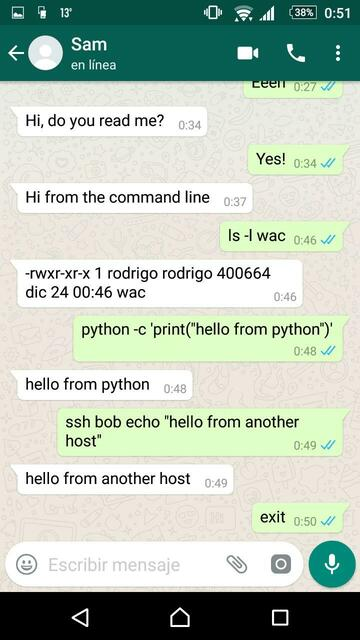

## WhatsApp C library

A fast and lightweight C library to connect to WhatsApp. Requires a phone with a
working version and connected to the internet, similarly as the web version.

The following libraries are required:

- libwebsockets
- libqrencode
- libcrypto
- libjson-c
- libprotobuf-c
- libcrypto (OpenSSL)

Still under HEAVY development. Pull requests are appreciated.

Based on the great reverse engineering work of sigalor:
[whatsapp-web-reveng](https://github.com/sigalor/whatsapp-web-reveng)

### Objective

The library will provide a simple way to build clients. For instance a bitlbee
plugin to add WhatsApp as an available protocol to IRC.

### Current status

The library provides the ability to send and receive private text messages, no
photos or other media are supported yet, neither group messages.

The built-in client `wac` reads from the standard input, and sends the lines as
messages to the specified recipient in the argument. The received messages are
shown in the standard output. The phone should be specified in the following
format:

	<country code><phone>@s.whatsapp.net

For example, the number 666666666 in Spain, would be
`34666666666@s.whatsapp.net`. Some examples using the standard input:

	% PHONE=34666666666@s.whatsapp.net
	% wac $PHONE
	Hi, do you read me?
	Yes!

It can also be piped, as any UNIX like program, for example:

	% echo Hi from the command line | wac $PHONE

Or to get a remote shell:

	% mkfifo fifo
	% wac < fifo | bash > fifo

